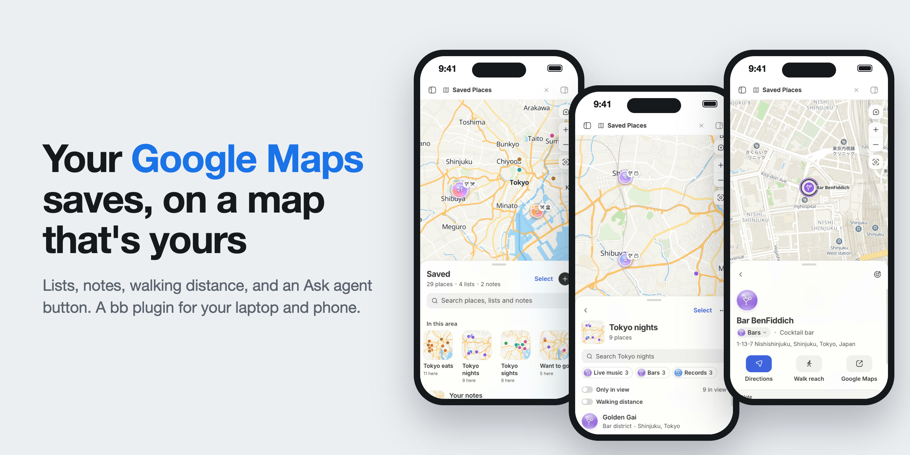
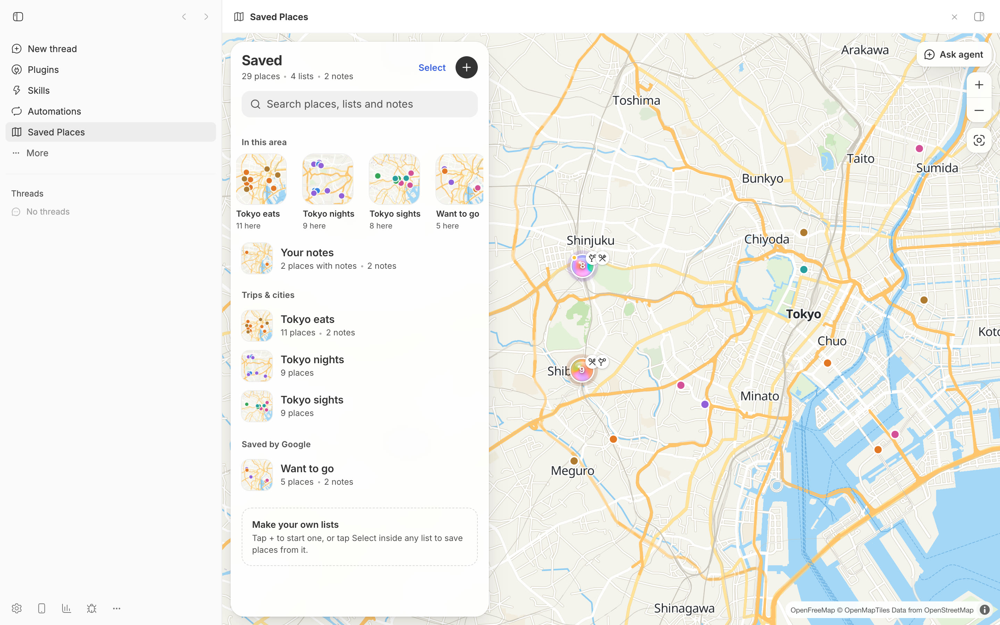
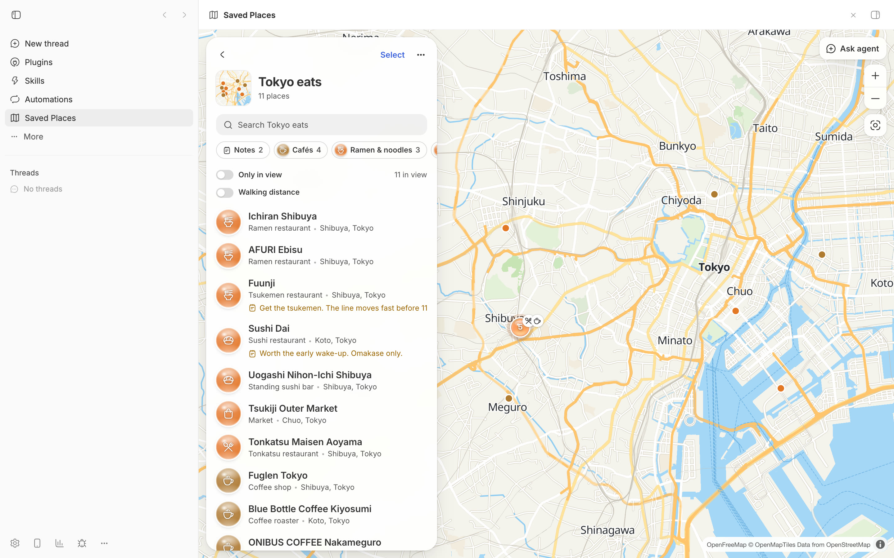
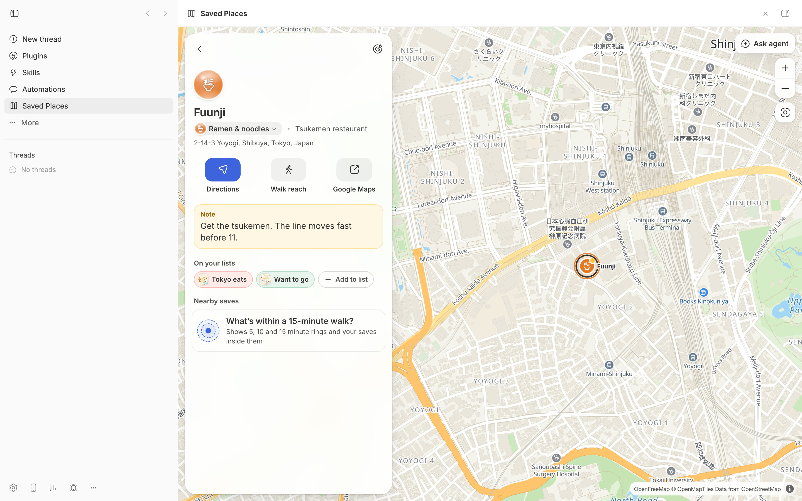
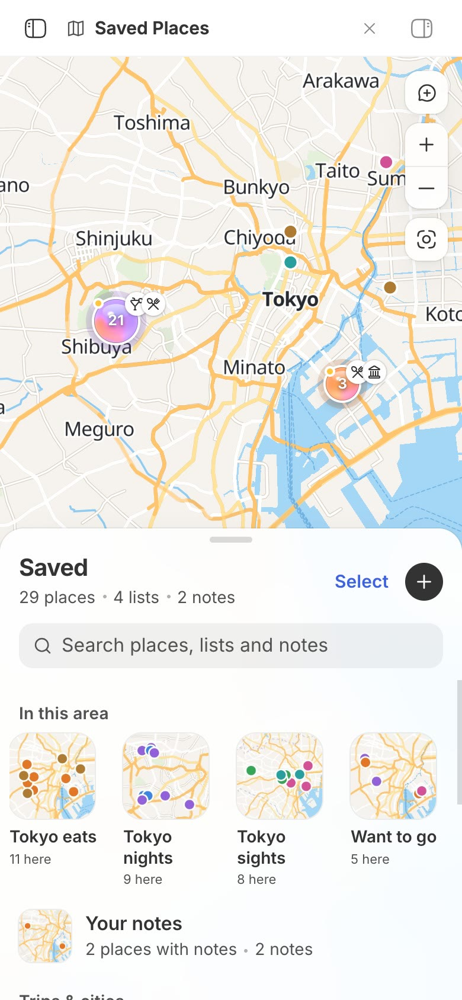
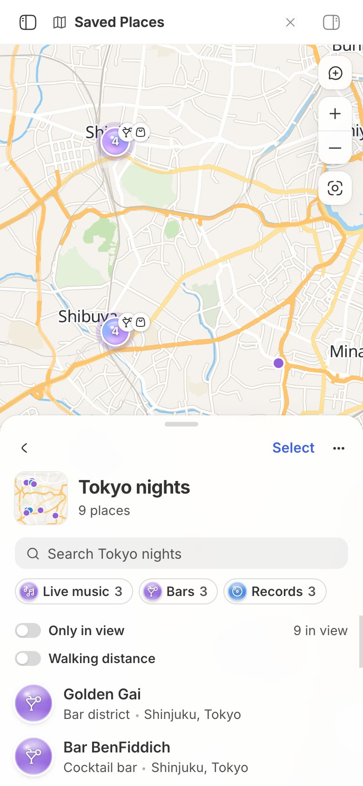
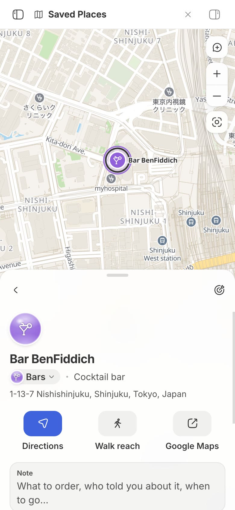
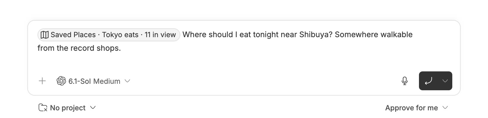

# Saved Places

All your saved Google Maps places on one map you'll actually use. Paste one prompt into [bb](https://getbb.app/?utm_source=github&utm_campaign=saved-places) and an agent:
- opens Google Maps in bb's browser so you can sign in;
- pulls every saved list, with coordinates, into your own copy of this template;
- sorts each place into a category, like ramen, record stores, or viewpoints.

You get lists, notes, walking distance between places, and an **Ask agent** button that hands what's on your map to an agent. It works on your phone too.



## Start

Requires **Claude Code or Codex installed and signed in locally** on your computer.

1. [Download bb](https://getbb.app/?utm_source=github&utm_campaign=saved-places).
2. Paste this into a new thread:

```text
Set up Saved Places from https://github.com/brsbl/saved-places and import my saved Google Maps lists.
```

For phone access, keep your computer on and plugged in, with bb open.

**Agents:** follow [`skills/saved-places/SKILL.md`](skills/saved-places/SKILL.md) from step 0.

## Google Maps

The agent opens [Google Maps](https://www.google.com/maps) in bb's browser for you. Sign in when it asks, then tell it when you see your saved lists. It never asks for your password or copies cookies from another browser.

Your places stay on your machine, in `data/saved-places.json` in your copy. Keep that copy private: if you put it on GitHub, make the repository private.

The import is a snapshot, not a live sync. Ask again to refresh it; your notes, custom lists, and category fixes stay attached.

## Examples

These use the sample places in Tokyo that ship with the template.

| Library | A list | A place |
| --- | --- | --- |
|  |  |  |
|  |  |  |

**Ask agent** starts a thread with a snapshot of your map attached:



## How to use

- **Lists.** Open any list for category chips, an "Only in view" filter, and its places on the map. Search matches places, lists, and notes.
- **Your own lists.** Tap + to start one, or tap Select in a list and choose Add to list.
- **Notes.** Leave a note on any place; it shows on rows, pins, and clusters.
- **Walking distance.** On a place, Walk reach shows 5, 10, and 15-minute rings. On a list, Walking distance shades a walk around each place, so you can see which saves are near each other.
- **Categories.** Tap a place's category to fix it. Fixes survive re-imports.
- **Ask agent.** Starts a thread with the camera, filters, and places in view attached. Add your question and send it.
- **On your phone:** the agent sets up remote access, opens the bb sign-in page if needed, and gives you a link to open in your phone's browser. Sign in with the same GitHub account if asked, then open Saved Places from the sidebar.

## Map services

The map uses free, keyless services. Check their usage policies before heavy use.

| Service | Used for | Change it in |
| --- | --- | --- |
| [OpenFreeMap](https://openfreemap.org) | Vector tiles and fonts for the basemap and list covers | `streetsStyle` in `basemap.ts` |
| [Valhalla](https://valhalla1.openstreetmap.de) public server (FOSSGIS) | Walking rings and walking distance | `ENDPOINT` in `routing.ts` |

Map data © OpenStreetMap contributors.

## Develop

```bash
npm ci
npm run check
bb plugin install "path:$PWD" --yes
```

`npm run check` typechecks, builds, and runs the tests. To look around with only the sample places, run `bb plugin install git:https://github.com/brsbl/saved-places.git --yes`. Import formats, categories, and list grouping are in [`reference.md`](skills/saved-places/reference.md). `tooling/` vendors bb's plugin builder and SDK; their versions and sources are in `tooling/vendor/*-provenance.json`.
