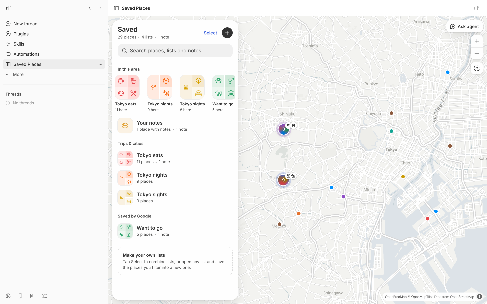

# Saved Places

Your saved places on a map that gets clearer as you zoom. Browse lists, build your own, leave notes, see what's within a 5/10/15-minute walk of a place or a whole list, and hand the current map view to an agent with **Ask agent**.

It ships with a small sample of public places in Tokyo. Import your own Google Maps lists or any CSV to make it yours.



## Install

```bash
bb plugin install git:https://github.com/brsbl/bb-plugins.git@plugin/saved-places --yes
```

Requires bb 0.43 or newer. The published build contains the sample data; install from source to use your own places.

## Use

Open Saved Places from a thread's panel menu or the sidebar.

- **Library.** Lists, custom lists, and notes, each with a cover. Search matches places, lists, and notes.
- **Lists.** Category chips, an "Only in view" filter, and a map chip with the in-view count.
- **Custom lists.** Build a list from one or more lists, the current filter, or what's in view.
- **Notes.** A short note on any place; notes show on rows, pins, and clusters.
- **Walking reach.** 5/10/15-minute walking rings around a place, with everything outside dimmed.
- **Walking distance.** On a list, shade a 5, 10, or 15-minute walk around each place (up to 12) to see which saves are walkable from each other.
- **Ask agent.** Starts a new thread with a snapshot of the current map view (camera, filters, places in view, notes) attached as a mention.

Agents can read the same data with `bb saved-places list|collections|lists|notes --json`.

## Use your own places

Custom lists and notes live in bb's plugin storage. Places come from `data/saved-places.json`, which is gitignored; the first build copies `data/sample.json` there.

1. Export your lists from [Google Takeout](https://takeout.google.com) by selecting **Saved** (lists as CSV) and **Maps (your places)** (starred places as `Saved Places.json`).
2. Import them, one list per file:

   ```bash
   npm run import --workspace=bb-plugin-saved-places -- --geocode \
     ~/Downloads/Takeout/Saved/*.csv \
     "~/Downloads/Takeout/Maps (your places)/Saved Places.json"
   ```

3. Install from source (see [Develop](#develop)).

Takeout list CSVs contain names and links but no coordinates, so `--geocode` looks them up with [OpenStreetMap Nominatim](https://nominatim.org/release-docs/latest/api/Search/) at one request per second and caches the results in `data/.geocode-cache.json`. Places it can't find are skipped and listed.

Any CSV with `name`, `latitude`, and `longitude` columns also works, with optional `address`, `url`, `list`, `category`, and `type` columns. A `list` column splits one file into several lists. GeoJSON files of Point features work too.

Each place gets its category from its Google place type, narrowed by its name (a "Restaurant" named "Sushi Sho" is Sushi), or from its name alone when it has no type; addresses are never used. A specific `category` in your CSV, such as `museum`, overrides both. Categories belong to ten color groups (Food, Cafés & sweets, Nightlife, Culture, Outdoors, Shopping, Stays, Wellness & fun, Getting around, Other); a place takes its group's color and its category's icon, and the basemap's own points of interest use the same icons and colors. To add or change a category, edit its row in `categories.ts` (label, name/type pattern, and the OpenMapTiles POI classes it covers) and its icon in `category-icons.ts`. Lists without photos use a small map of their places as the cover. Lists titled "Favorite places", "Want to go", or "Starred places" are grouped as saved by Google; see `groupFor` in `model.ts`.

## Map services

The map uses free, keyless services. Check their usage policies before heavy use.

| Service | Used for | Change it in |
| --- | --- | --- |
| [OpenFreeMap](https://openfreemap.org) | Vector tiles and fonts for the streets basemap and list-cover maps | `streetsStyle` in `basemap.ts` |
| [Valhalla](https://valhalla1.openstreetmap.de) public server (FOSSGIS) | Walking rings and walking distance | `ENDPOINT` in `routing.ts` |

Point `ENDPOINT` at your own [Valhalla](https://github.com/valhalla/valhalla) instance for heavier routing. Map data © OpenStreetMap contributors.

## Develop

From the monorepo root:

```bash
npm ci
npm run check --workspace=bb-plugin-saved-places
bb plugin install "path:$PWD/plugins/saved-places" --yes
```
